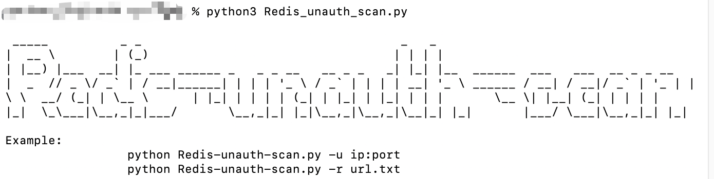
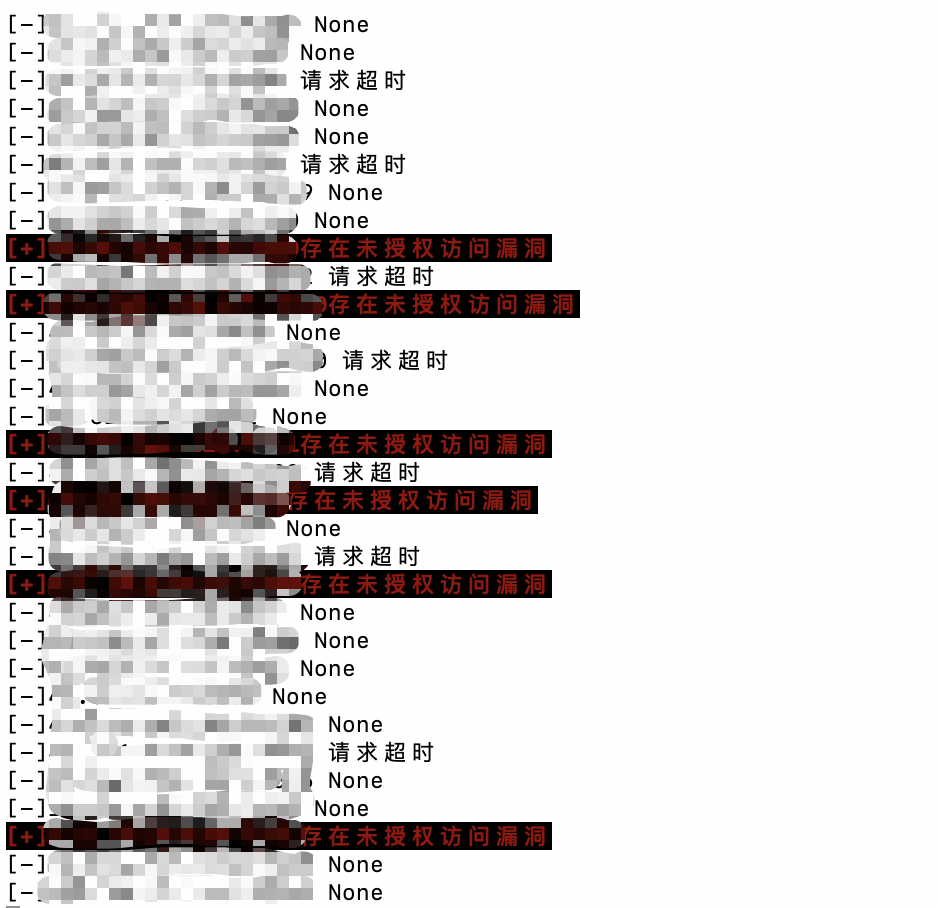
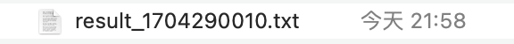

# Redis-unauth-scan

1. redis未授权访问漏洞检测脚本，支持单个url检测和多url批量检测

2. 使用说明。url的格式必须是ip:port
   
   ```shell
   -h/--help  #帮助信息
   -u ip:port #单个url检测
   -r url.txt #多个url批量检测
   ```
   
   

3. 检测效果
   
   

4. 扫描完成后会在脚本目录下生成result_ + 时间戳的txt文件并将存在redis未授权访问漏洞的url写入该文件。
   
   
